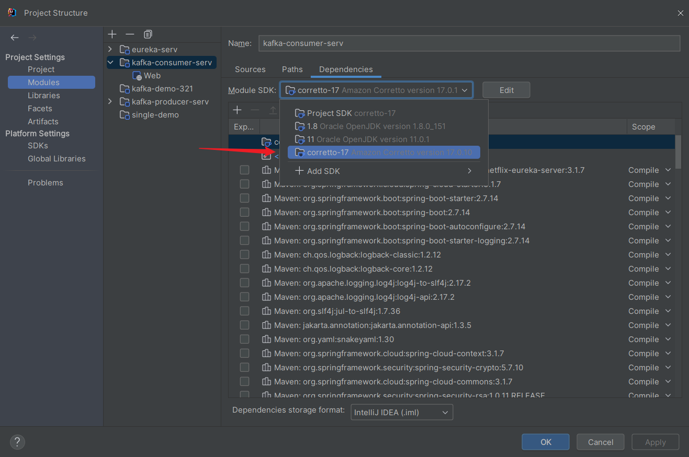
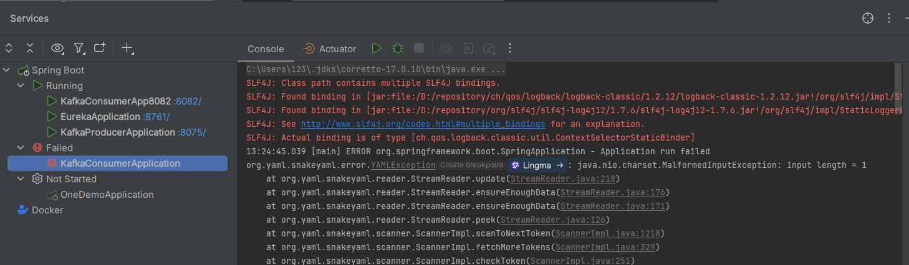
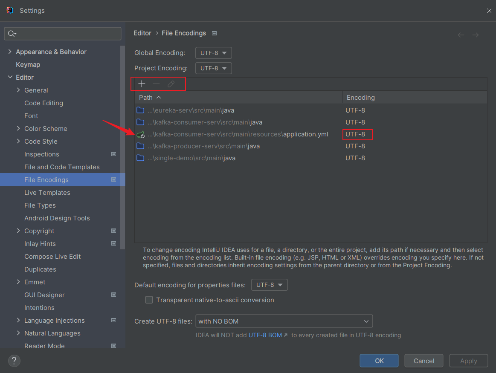
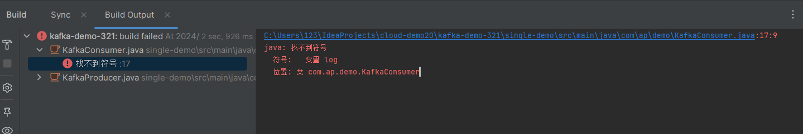
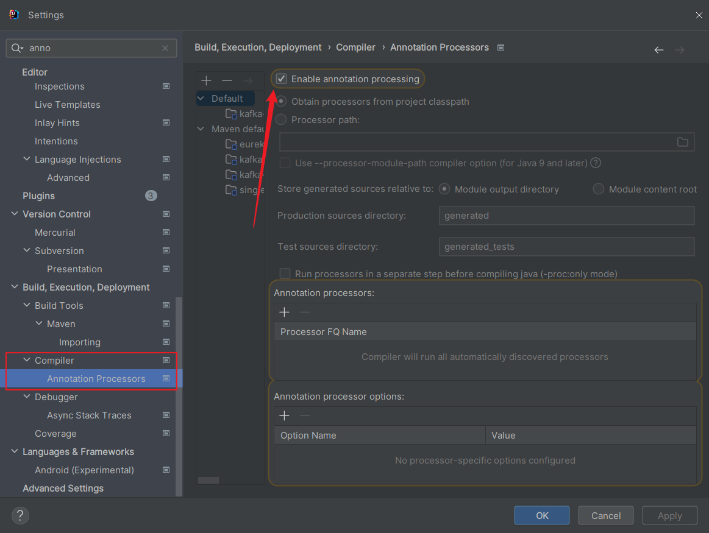
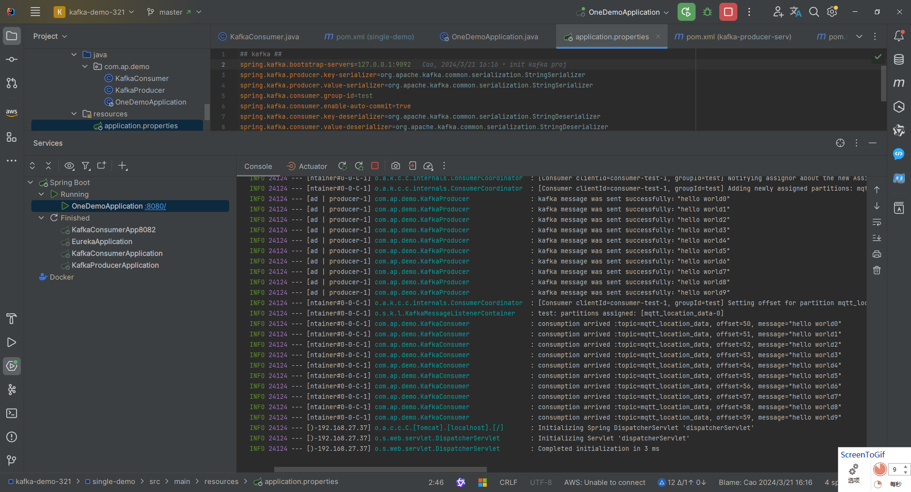
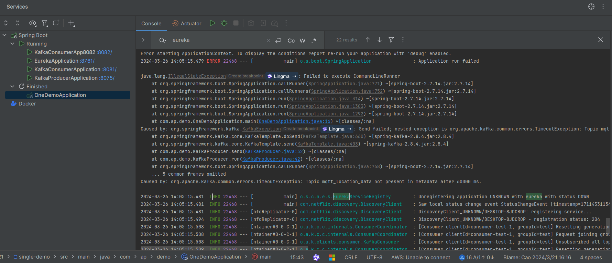
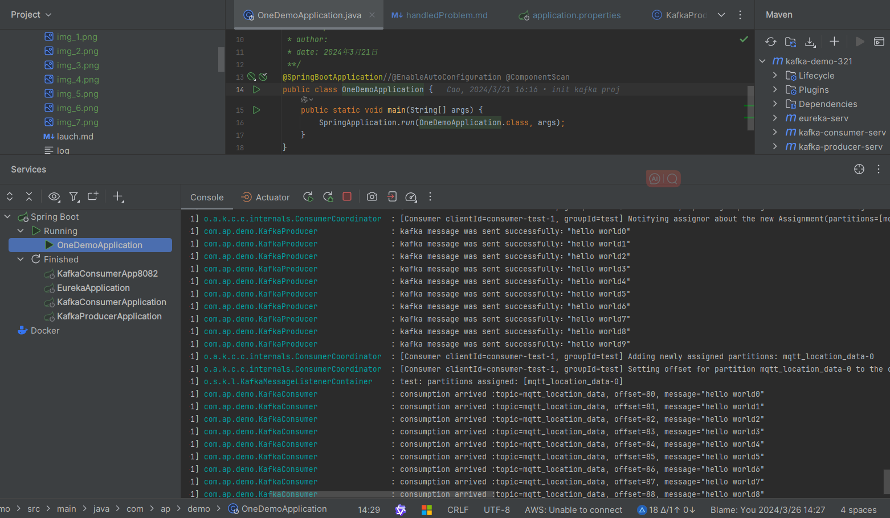
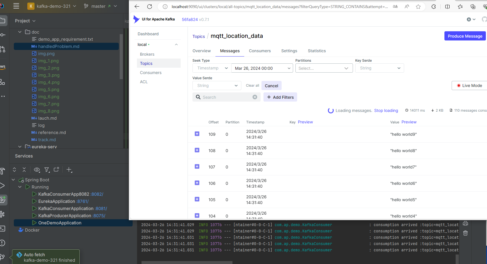

1.git 报403
成因：用了自己的github账号去推送AWS

git 报错403-->
去命令行，右键bash here ，git config --global credential.helper store
配置密码，更换账号

参考自：https://www.hi917.com/detail/43.html

2.git 报错443
起因：清空了代理配置信息。执行了以下命令：
git config --global --unset http.proxy
git config --global --unset https.proxy

git 报错443-->
命令行-->
git config --global http.proxy http://127.0.0.1:7890
git config --global https.proxy http://127.0.0.1:7890

参考自：https://zhuanlan.zhihu.com/p/648164862

3.
装内存条后idea设置被重置，重新激活破解并启动原有项目，出现application启动不起来的报错，都已解决：

第一种是jdk未指定报错：成因：
idea自带的jdk在默认启动时不指定会有概率出问题：解决：去给模块指定本地磁盘的jdk

第二种是：yaml文件格式编码未指定导致启动前编码失败，解决：把编码全改为UTF-8，再clear，build，run就搞定了
Application run failed
     org.yaml.snakeyaml.error.YAMLException: java.nio.charset.MalformedInputException: Input length = 2

或者：
13:24:45.039 [main] ERROR org.springframework.boot.SpringApplication 
- Application run failed
org.yaml.snakeyaml.error.YAMLException: java.nio.charset.MalformedInputException: Input length = 1

解决：

4.lombok编译文件不生效，启动报错：17:9
java: 找不到符号
符号:   变量 log
位置: 类 com.ap.demo.KafkaConsumer
或者是找不到getter等，都是lombok没找到合适的版本

原因：lombok版本太低了

解决：在pom里加版本

完成：

5.单个示例模块启动报错：
说明：这是一个示例模块，不需要注册为一个微服务，但是父项目引入了依赖

原因： 没有依赖排除eureka

单个示例模块它只需要演示发和收消息，在启动之前要启动kafka的容器

查看消息：

6.经常过一段时间就报错jdk未指定或者yaml编码导致启动失败的错，怀疑是idea的bug，决定升级idea的版本
