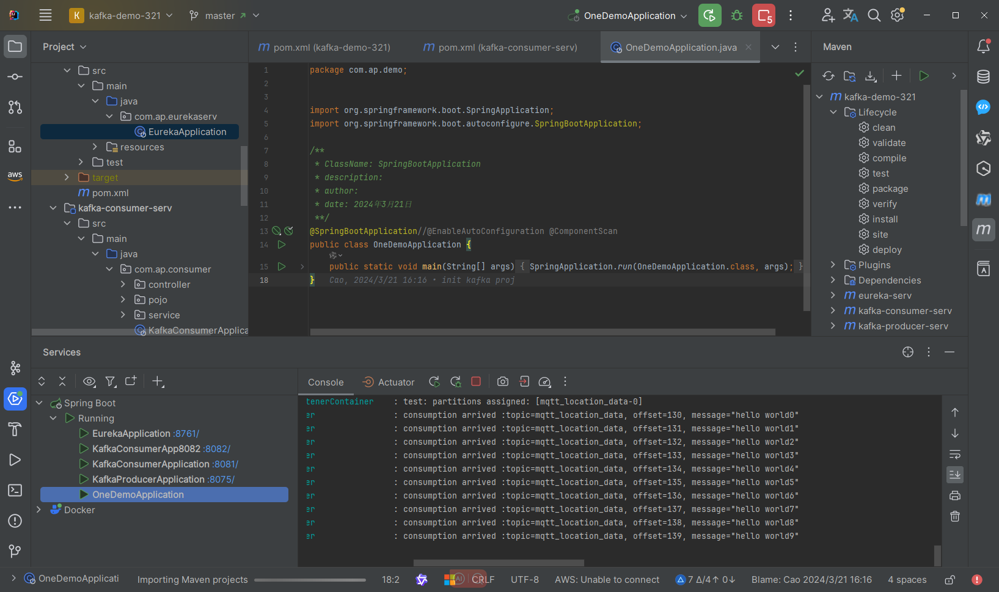

# kafka-demo-321

#### 介绍
技术栈：Eureka、Kafka、SpringBoot、slf4j

#### 软件架构
软件架构说明

#### 安装教程

1.  进入根目录，打开命令行，执行 docker-compose up -d命令，等待容器安装完成
2.  启动容器kafka和kafka-ui，注意这里的GUI端口是http://localhost:9090/
3.  如果kafka-demo-321目录下的docker-compose.yml运行不成功，就去kafka-demo-321/src/下去执行docker-compose up -d命令
4. 

#### 使用说明

1.  xxxx
2.  xxxx
3.  xxxx

#### 参与贡献

1.  Fork 本仓库
2.  新建 Feat_xxx 分支
3.  提交代码
4.  新建 Pull Request

#### 运行效果

1. 
2. 
3. 
4. 
5. xxxx
6. xxxx
7. xxxx
